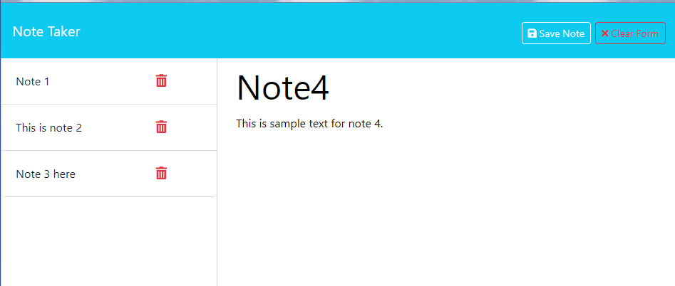

  # Note_Taker

  
  

  ## Description
  This application allows the user the ability to write and save notes so that the user can organize their thoughts and keep track of tasks they need to complete.
  
  ## Table of Contents
  - [Installation](#installation)
  - [Usage](#usage)
  - [License](#license)
  - [Contributing](#contributing)
  - [Tests](#tests)
  - [Questions](#questions)
  
  ## Installation
  none
  
  ## Usage
  To use the application, navigate to the following URL in your browser: https://morning-anchorage-46861-5368430cc715.herokuapp.com/ and follow onscreen instructions.

  
  
  ## License
  This project is licensed under [MIT license](https://opensource.org/license/MIT).
  
  ## Contributing
  
  
  ## Tests
  
  
  ## Questions
  If you have any questions, please feel free to reach out to me on [GitHub](https://github.com/RobertWright0830) or by email at RobertWright0830@aol.com.
  